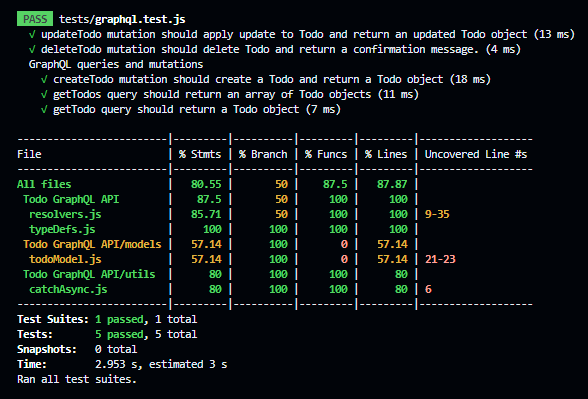

# Mid Level Back-End Developer

## Tech Stack
### Main Dependencies
 * **node.js** and **express** as the JavaScript runtime environment and server framework.
 * **mongodb** as a database of choice.
 * **mongoose** as an ODM library of choice.
 * **apollo-server-express** as the GraphQL server of choice.
 * **graphql**- a query language for APIs.
 * **graphql-tools**- includes useful tools to create, test and manipulate GraphQL schemas.
 * **jest**- JavaScript Testing Framework.

## Main Files: Project Structure

  ```sh
  ├── README.md *** Instructions on how to set-up the project locally and API reference.
  ├── package.json *** The dependencies to be installed with "npm install"
  ├── server.js *** Entry point of the app
  ├── typeDefs.js
  ├── resolvers.js
  ├── db.js
  ├── .env
  ├── example.env
  ├── models
  │   ├── todoModel.js
  ├── utilss
  │   ├── catchAsync.js
  ├── tests
      └── graphql.test.js
```

## Getting Started Locally

### Prerequisites & Installation
To be able to get this application up and running, ensure to have [node](https://nodejs.org/en/download/) installed on your device.

### Development Setup
1. **Download the project locally by forking this repo and then clone or just clone directly via:**
```bash
git clone https://github.com/omobolajisonde/Backdrop-EC.git
```
2. **Create a .env file just like the example.env**

3. **Set up the Database**
   - Create a MongoDB database on your local MongoDB server or in the cloud (Atlas).
   - Copy the connection string and assign it to the `DATABASE_URI` environment variable.
   - Do the above two steps for the `TEST_DATABASE_URI` too.
   - On connection to the database, the `todos` collections would be created.
  
## Models
---

### Todo
| Field  |  Data type | Description |
|---|---|---|
|  _id |  ObjectId |  auto-generated |
|  title | String  |  required |
|  description | String  | |
|  completed  |  Boolean | Defaults to false |
|  createdAt |  Date |  Defaults to current timestamp |
|  updatedAt |  Date |  Defaults to current timestamp |


4. **Install the dependencies** from the root directory, in terminal run:
```
npm install
```

5. **Run the development server:**
```bash
npm run dev
```
1. **At this point, your server should be up and running** at [http://127.0.0.1:5000/](http://127.0.0.1:5000/) or [http://localhost:8080](http://localhost:8080)

---

## Viewing the application in a browser
Visit http://127.0.0.1:5000/ or http://localhost:8080/ on your browser.

---
## Testing
In order to run tests, navigate to the root directory and run the following commands:
``` bash
npm test
```

>**Note** - All tests are in the `tests` folder.

## API Reference
### Endpoints
`/graphql`

### Query Types
`getTodo`

Returns a Todo item. This query has the following parameters:

- id: A required parameter used to query a specific Todo. This field takes a String as an input.


`getTodos`

Returns an array of Todo items.


### Mutation Types
`createTodo`

Creates a new Todo. This mutation has the following parameters:

- title: A required parameter for the title of the Todo. This field takes a String as an input.
  
- description: An optional parameter to further describe the Todo.

`updateTodo`

Updates an existing Todo. This mutation has the following parameters:

- id: A required parameter used to query a specific Todo to update. This field takes a String as an input.

- update: A required parameter containing the update to be applied to the Todo. This field takes an object in the format below:
```json
{
    "title": "An updated Todo", // An optional parameter to update a Todo title. This field takes a String as an input.
    "description": "An updated Todo description", // An optional parameter to to update a Todo description.
    "completed": false // An optional parameter to to update a Todo completed status.
}
```

`deleteTodo`

Deletes a Todo. This mutation has the following parameters:

- id: A required parameter used to query a specific Todo to delete. This field takes a String as an input.

## Example Usage

### Query Example

```
query {
  getTodos{id, title, description, completed}
}
```

### Mutation Example

```
mutation {
  createTodo(todo: {
        title: "Complete the Mid Level Back-End Developer Task.",
        description: "Develop a GraphQL API for a to-do list application using MongoDB and AWS Lambda.",
      }){id, title, description, completed}
}
```
## Deployment
https://backdrop-ec.onrender.com

## Authors
[Sonde Omobolaji](https://github.com/omobolajisonde) 